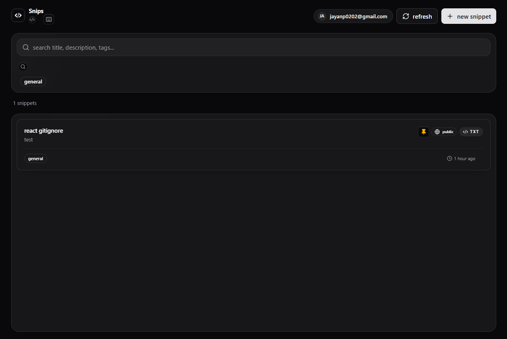
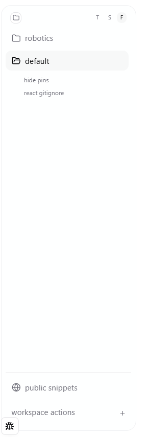
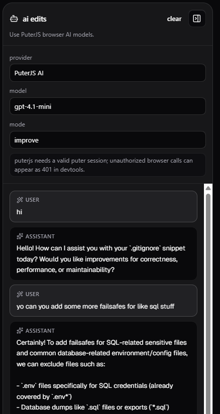

<div align="center">
  <h2><code>KingJayan/code-snippet-library</code></h2>
  <p>minimal, fast personal (and shared) code snippet vault.</p>
</div>

## features

- organize + pin snippets  
- public sharing + `/public` discovery  
- fast tag search + themes
- magic link auth  

- AI assistant (improve, refactor, debug, explain)  
- optional AI search, auto-tags, docs  

- built-in runner (`py`, `cpp`, `txt`, `md`)  
- stats, metadata + flexible copy modes  

## stack

next.js • typescript • tailwind • shadcn/ui  
supabase (postgres + auth)  
shiki • codemirror  
ai: openai • anthropic • gemini • ollama • openrouter  

## preview

dashboard  


explorer  


ai panel  


## setup

```bash
npm install
npm run dev

2. create `.env.local`

```env
NEXT_PUBLIC_SUPABASE_URL=your-project-url
NEXT_PUBLIC_SUPABASE_PUBLISHABLE_KEY=your-publishable-key
NEXT_PUBLIC_APP_URL=https://your-production-domain.com
```

optional ai:

```env
OPENAI_API_KEY=
ANTHROPIC_API_KEY=
GEMINI_API_KEY=
OPENROUTER_API_KEY=
OPENAI_COMPATIBLE_API_KEY=
OLLAMA_BASE_URL=http://localhost:11434

# optional: allow non-local ollama host (off by default for safety)
SNIPS_AI_ALLOW_REMOTE_OLLAMA=0

# optional: enable dev debug panel for a specific account (dev only)
NEXT_PUBLIC_DEV_OWNER_EMAIL=

# optional server execution sandbox config (not used by default free mode)
SNIPS_EXEC_PROVIDER=piston
SNIPS_EXEC_PISTON_URL=
```

3. run supabase/schema.sql and refresh api cache

## keyboard shortcuts

- n new snippet
- ? shortcuts
- esc close / clear
- cmd/ctrl + enter save
- e edit • c copy
- pin -> stays on top
- share -> public link
- tags -> comma-separated
- AI -> improve / refactor / debug / explain
- run -> python (local), cpp (external)

## notes

- python runs in-browser (pyodide)
- cpp requires external runner
- execution returns stdout, stderr, runtime, memory
- benchmarks: chars, bytes, bits, lines
- metadata: views, copies, timestamps
- tags deduped, lowercase, 30 char max
- theme + settings persist locally
- fast: virtualized list, cached highlighting, efficient filtering

## scripts

```bash
npm run lint
npx tsc --noEmit
npm run build
```

## contributing

- see [CONTRIBUTING.md](CONTRIBUTING.md)

## deploy

vercel ready; make sure supabase auth url is configured

### made with :) by jayan
